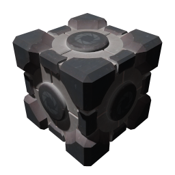
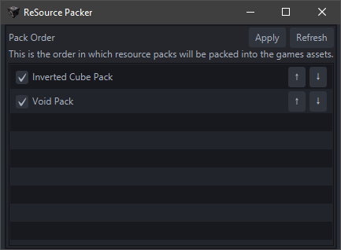

 
# Source Resource Packer
Source Resource Packer aims to provide a streamlined, easy to follow process for asset swapping in Source games by providing automatic conversions and providing convenient, clean file structures to work with. **Currently only works with Unpacked variants of Source games, like Source Unpack for portal, but will support other games in the future.**

### Installation
1. Download the latest zip archive from releases.
2. Extract the contents into your Source game directory. For instance, Source Unpack for portal, the game directory is where `Portal.bat` and the `portal` folder are located. Unpack it alongside those files.
3. Profit.

### First Time Setup
When you first start the application, it will extract all the default resources from the game's assets. This is important to understand because these will be the same resources you might reference when creating a resource pack, so this is best done on a clean install, or at least an install with clean assets. It will still work if you have modified assets, but those will become what SRP understands as the "default" ones. Mind you, **this can take quite a while if you have a slow hard drive,** but this only happens the first time you start SRP.

### First Impression
  
When you first install SRP, you'll be greeted with this screen. By default, you won't have a lot going on, however after the first time setup has completed running, you'll have a few new folders in your game directory: `resourcepacks` and `srp/resources`. The `resourcepacks` folder is where you'll place folders or zip files of resource packs to be packed into the assets using SRP. As you can see, I've provided you a couple to start with: `Inverted Cube Pack` and `Void Pack`. You don't have to use these, they're just for demonstration purposes of both how to apply resource packs and the file structure that resource packs follow.

### Sorting
The order that your resource packs in matter. It will apply them from top to bottom, where default resources are always first. This is important because if you have two resource packs that change the same files, the resource pack that comes second will inherently have "priority" and overwrite that file. Try not to have resource packs with conflict, but if it happens, this is how you try your best to mitigate it. Use the up and down arrow to the right of the resource pack entry to modify it's position in the list. Remember; they're applied TOP to BOTTOM.

### Toggling
You can click the checkbox to the left of the resource pack name to toggle it. If the box is unchecked, it's content won't be packed when you hit apply, and the default resources will be used instead.

### Applying
By hitting the apply button, you're verifying that the order and toggled state of your resource packs is ready to be packed into the games assets. This will open a progress window that looks like this:
  
This may take a couple of minutes to possibly tens of minutes, it all depends on the read and write speed of your storage. On my NVMe SSD, this only takes a minute or so. But you might find yourself staring at the pretty blue progress bar for a little while otherwise. Once the default assets are done packing, it will then begin packing your resource packs in the order you specified,  and each packs application will look like this:
  
Unless the resource pack has 4k images or giant models or something, this shouldn't really take very long for each pack. And, finally, once it's all done and packed, you'll see this:

### Refreshing the List
The refresh button is relatively straight forward, but any time you add or remove a resource from the actual `resourcepacks` directory, you'll want to hit that refresh button so SRP see's the change. It will try its best to maintain order and toggled resource packs as well, and just add the new ones as additional resource packs to your list.

## Resource Pack Creation

Probably the most interesting part of this software is the ability to easily create a resource pack. A resource pack works by going through all the files in its folder, converting if necessary (png -> vtf, for example), and moving the file to the reflected location in the games actual assets.

### Example
If you wanted to replace the portal gun texture which is located in:  
`portal/materials/models/v_models/v_portalgun/v_portalgun.vtf`  
You would create that same folder structure in your resource pack folder, so:  
`pack/portal/materials/models/v_models/v_portalgun/v_portalgun.png`  
Yes, you can use a PNG instead of a VTF. It will automatically be converted to VTF for you when packing. For more examples of how you might structure a resource pack, look at the ones provided when you downloaded.

### Getting Assets to Modify
**Note**: do not modify anything in the asset cache unless you 100% know what you're doing and why. It's never necessary, unless you broke it somehow in the first place. No touchy.  

If you don't want to deal with converting VTFs to PNGs and PNGs to VTFs, you can use the asset cache to find the PNG files that make up the VTFs. Just navigate to `srp/resources` and navigate to the asset you want. There is a backup VTF as well as PNG in there that you can use, but you should only need the PNG.  

**The PNG might look like it's completely transparent, for instance, the `portal/materials/models/props/metal_box.png`. This is totally normal, open it in your texture editor and disable the "alpha" color channel, you'll see the texture more clearly.**

# Closing Thoughts

 - Be careful. Theoretically, a resource pack can overwrite any asset, and that could be harmful to your game installation. Check the contents of resource packs you might install and use if you're not 100% certain you can trust the creator.  

 - I plan to add support for more than just PNG -> VTF and VTF -> PNG. Eventually, I'd like this to support model conversion, and an easier to understand particle format.